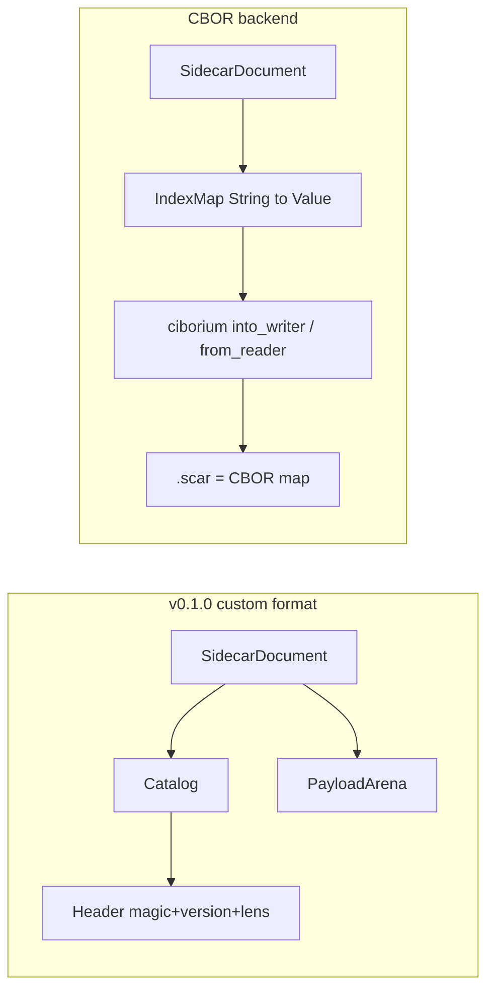

# CBOR Backend Migration

## Goal

Make the `.scar` file a **pure CBOR document** (a CBOR map at the root), encoded/decoded with [`ciborium`](https://docs.rs/ciborium). Remove the entire hand-rolled format (`Header`, `Catalog`, `PayloadArena`, inline/payload split, type tags). Embrace CBOR's model: nested maps and heterogeneous arrays become first-class, resolving the earlier flat-only limitation. No backwards compatibility with v0.1.0 files.

## Architecture change

## Key decisions

- Crate: `ciborium = "0.2.2"`; `indexmap = "2"` for the root map (preserves insertion order so `entries()` stays deterministic).
- New `Value` enum mirrors CBOR: `Null`, `Bool(bool)`, `Integer(i128)`, `Float(f64)`, `Text(String)`, `Bytes(Vec<u8>)`, `Array(Vec<Value>)`, `Map(IndexMap<String, Value>)`.
- Semantic changes vs v0.1.0: `F32`/`F64` collapse to `Float`; `I64`/`U64` collapse to `Integer`. Typed setters stay for ergonomics/wire size but values read back as the canonical CBOR type. Arrays are now heterogeneous. Map keys must be strings.
- File framing: pure CBOR, no magic/version bytes. Keep `.scar` extension and `_media.basename` reserved key.
- Breaking on-disk change -> bump workspace version `0.1.0` -> `0.2.0`.

## Implementation Status

- [x] Plan saved
- [x] Dependencies
- [x] Value model
- [x] Document codec
- [x] Errors
- [x] Remove format module
- [x] CLI
- [x] Python bindings
- [x] Tests
- [x] Docs and version bump
