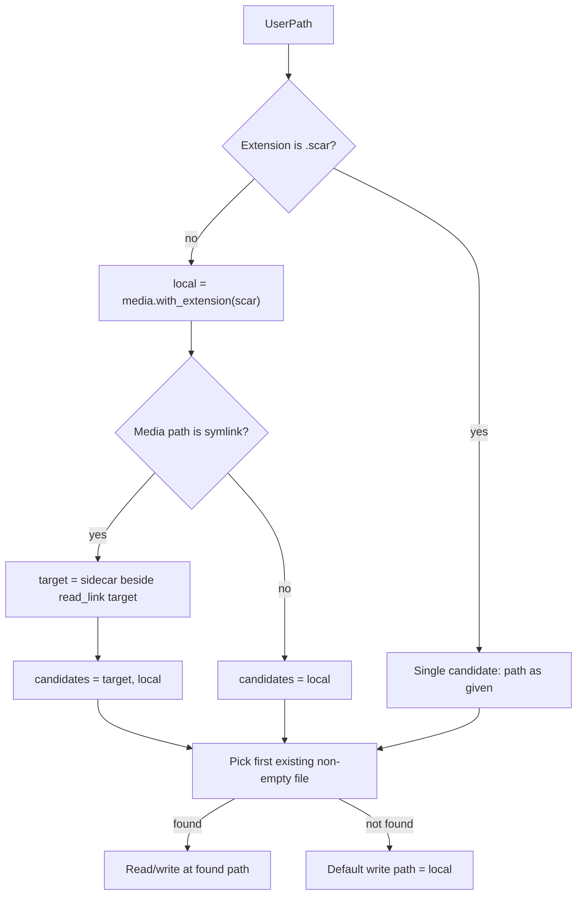

# Symlink-aware sidecar path resolution

## Problem

Today sidecar paths are derived only from the path the caller passes in (`sidecar_path_for_media` in `sidecar/src/lib.rs`):

```rust
pub fn sidecar_path_for_media(media_path: &std::path::Path) -> std::path::PathBuf {
    media_path.with_extension(SIDECAR_EXTENSION)
}
```

If `/album/link.jpg` is a symlink to `/vault/IMG_001.jpg` with metadata at `/vault/IMG_001.scar`, CLI commands like `sidecar get /album/link.jpg key` fail because they only look for `/album/link.scar`.

There is no symlink handling anywhere in the Rust code (`resolve_sidecar_path` in `sidecar-cli/src/main.rs` is CLI-only and extension-swap only).

## Decisions

| Case | Policy |
|------|--------|
| Read lookup | Check **both** locations; **target-adjacent first**, then symlink-adjacent |
| Write / update | Write back to **wherever the sidecar was found** |
| Create (new sidecar) | Unchanged: write beside the path passed in (`sidecar create /album/link.jpg` → `/album/link.scar`) |
| Direct `.scar` input | Use path as given (no media extension to derive alternate location) |

## Resolution flow



## Implementation

### 1. New path module in the library

Add `sidecar/src/paths.rs` with small, testable helpers:

- **`symlink_target(path)`** — if `symlink_metadata(path)` is a symlink, `read_link` + resolve relative targets against `path.parent()`; return `None` on broken links or non-symlinks
- **`sidecar_candidates_for_input(path)`** — build ordered candidate list:
  - `.scar` input → `[path]`
  - media input + symlink → `[sidecar_path_for_media(target), sidecar_path_for_media(path)]`
  - media input, not symlink → `[sidecar_path_for_media(path)]`
- **`find_existing_sidecar(candidates)`** — return first candidate where `is_file()` and `metadata().len() > 0`
- **`resolve_sidecar_path(path) -> PathBuf`** — public API

Export from `sidecar/src/lib.rs`: `mod paths;` + re-export `resolve_sidecar_path`.

**Symlink detection scope:** only when the **final path component** (the media file itself) is a symlink.

### 2. Wire CLI to library resolver

In `sidecar-cli/src/main.rs`: remove local `resolve_sidecar_path`, import from library.

### 3. Python bindings

Expose `sidecar_rs.resolve_sidecar_path(path: str) -> str`.

### 4. Tests

Rust integration tests in `sidecar/tests/symlink_resolution.rs` and one pytest in `tests/test_sidecar.py`.

### 5. Documentation

Update `README.md` quick-start section.

## Out of scope

- Merging sidecars when both exist (target wins exclusively)
- Resolving symlinks in parent directories of the media path
- Auto-creating a sidecar on `set` when none exists
